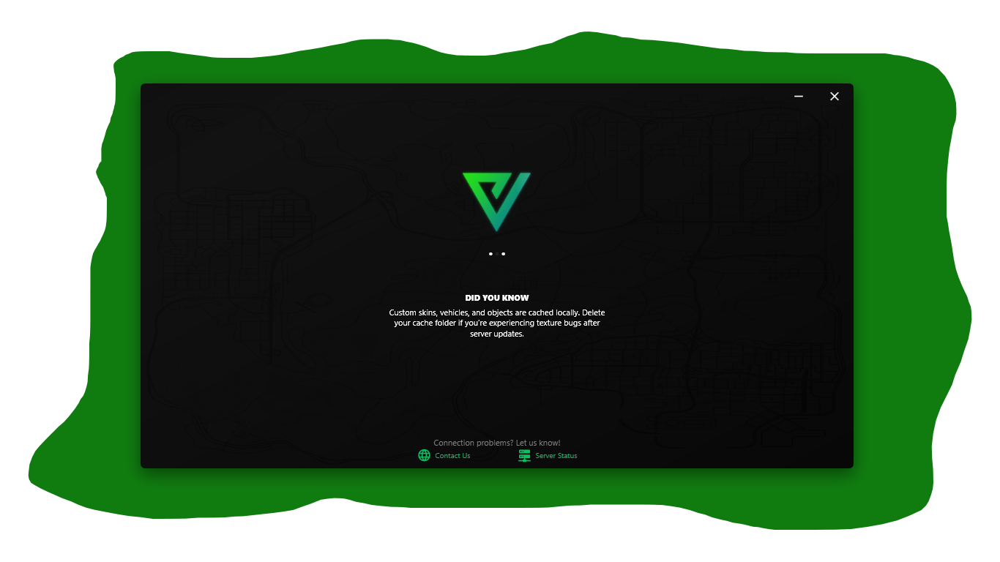
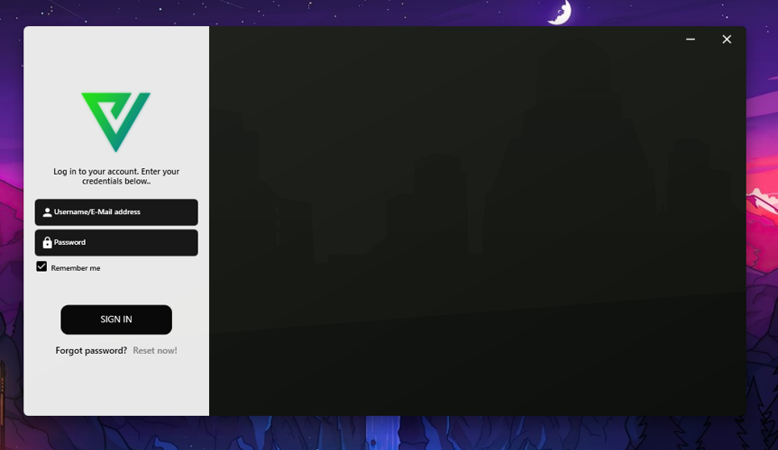

<h1 align="center">Velter Launcher</h1>

  <strong>Custom SA-MP Launcher for the Velter RolePlay server</strong>

<h2>📌 About the Project</h2>

Velter Launcher is a custom-built launcher designed specifically for the
<strong>Velter RolePlay</strong> SA-MP (San Andreas Multiplayer) server.
Its purpose is to provide players with a simple, fast, and reliable way
to connect to the server while serving as a centralized platform for
server-related features and information.

The launcher was developed with a strong focus on:

<ul>
  <li>Stability</li>
  <li>Ease of use</li>
  <li>Modern user interface</li>
  <li>A controlled and consistent player environment</li>
</ul>

<h2>⚙️ Features</h2>

<ul>
  <li>Automatic SA-MP client launch</li>
  <li>Basic requirement checks before connection</li>
  <li>Centralized server information</li>
  <li>Integration with the Velter RolePlay ecosystem</li>
  <li>Support for future updates without reinstallation</li>
</ul>

<h2>🖥️ Technologies</h2>

<ul>
  <li>Windows desktop application</li>
  <li>Custom UI design</li>
  <li>SA-MP client integration</li>
</ul>

Technical implementation details and source code are not publicly available.

<h2>📷 Preview</h2>

  
  
  

